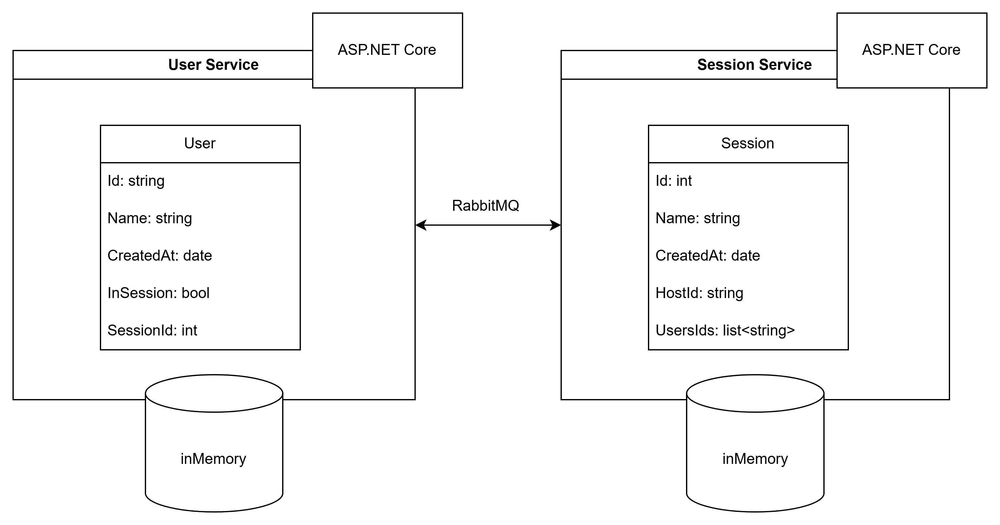

# Codename

This project implements a microservices architecture to manage the **Codename** game. Players can create and join game sessions while managing their profile information.

## 📖 Project Description

The application is structured around two independent microservices:
- **User Service**: Handles the management of player profiles.
- **Session Service**: Manages the creation, joining, and handling of game sessions.

In the future, more services will be added, but they are not implemented yet.

---

## ⚙️ Architecture
The services are designed to be independent and communicate via RabbitMQ.

- **User Service**: Responsible for managing player profiles.
- **Session Service**: Responsible for managing game sessions.



---

## 📂 Project Structure
```plaintext
codename/
│
├── UserService/             # User Service
│   ├── Controllers/         # REST Endpoints
│   ├── Models/              # Data Models
│   ├── Services/            # Business Logic
│
├── SessionService/          # Session Service
│   ├── Controllers/         # REST Endpoints
│   ├── Models/              # Data Models
│   ├── Services/            # Business Logic
│
└── README.md                # Documentation
```

---

## 💻 Technologies Used
- **Backend**: .NET 8
- **Messaging**: RabbitMQ
- **Database**: In-memory database for now (to be replaced in the future)

---

## 🙏 Acknowledgment

This Codename Project is inspired by the original **Codenames** board game designed by Vlaada Chvátil and published by **Czech Games Edition (CGE)**. We acknowledge and appreciate the creativity and design of the original game, which has provided the foundation for our digital implementation.  

This project is a learning initiative and is not affiliated with or endorsed by Czech Games Edition.